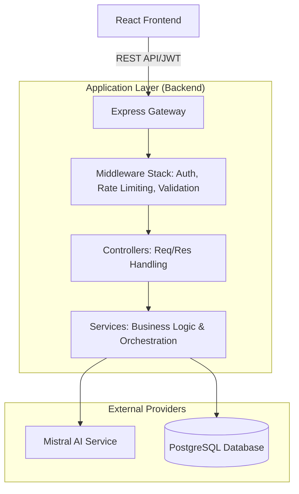

# AI Appointment Platform - Architect-Level Backend API

> A production-grade, multi-tenant AI-assisted appointment booking system built with **Node.js, Express, PostgreSQL**, and **Mistral AI**. Designed for robustness, scalability, and developer experience.

---

## 🏗️ High-Level Architecture

The system follows a **Layered Architecture** (Clean Architecture principles) to ensure separation of concerns and testability.

### System Overview


### Layered Structure
- **Routes Layer**: Handles HTTP entry points and mounts middleware.
- **Middleware Layer**: Enforces security (JWT), rate limiting, and input validation.
- **Controller Layer**: Decouples HTTP concerns from business logic.
- **Service Layer**: Contains core business rules, AI logic, and database orchestration.
- **Database Layer**: Implements multi-tenancy, soft deletes, and conflict prevention at the schema level.

---

## 🚀 How to Run Locally

### Prerequisites
- **Node.js**: ≥ 18.x
- **PostgreSQL**: ≥ 14.x
- **API Key**: Mistral AI (Free tier at [console.mistral.ai](https://console.mistral.ai))

### 1. Database Setup
```bash
# Connect to psql
psql -U postgres

# Create database
CREATE DATABASE appointment_platform;
\q

# Run schema and seed
psql -U postgres -d appointment_platform -f database/schema.sql
psql -U postgres -d appointment_platform -f database/seed.sql
```

### 2. Environment Configuration
Create a `.env` file in the `backend` folder:
```env
PORT=3000
DB_HOST=localhost
DB_PORT=5432
DB_NAME=appointment_platform
DB_USER=postgres
DB_PASSWORD=your_password
JWT_SECRET=your_generated_random_secret
MISTRAL_API_KEY=your_mistral_api_key
```

### 3. Installation & Execution
```bash
npm install
npm run dev
```
The server will start on `http://localhost:3000`. Test the health at `/health`.

---

## 💎 Architect-Level Design Decisions

### 1. Multi-Tenancy & Referential Integrity
**Decision**: Implementing a dedicated `businesses` table instead of just a raw ID string.
- **Rationale**: Enforces referential integrity. All `users`, `appointments`, and `chat_sessions` link to a real business entity.
- **Benefit**: Supports SaaS-level scaling, business-specific settings (timezones, hours), and proper data isolation.

### 2. Database-Level Race Condition Protection
**Decision**: A **Unique Partial Index** (`idx_unique_appointment_slot`) on `(business_id, date, time)`.
- **Rationale**: Application-level checks are prone to race conditions under high concurrency.
- **Benefit**: The database guarantees that no two active appointments can double-book the same slot, even if requests arrive milliseconds apart.

### 3. Soft Delete Strategy (Auditability)
**Decision**: Implementing `deleted_at` timestamps instead of hard `DELETE`.
- **Rationale**: Essential for production systems to provide an audit trail and accidental recovery.
- **Benefit**: Retains data for analytics while excluding it from active business logic via filtered indexes.

### 4. Layered Validation Strategy
**Decision**: Relaxed DB constraints combined with strict Backend validation.
- **Rationale**: DB constraints (`CHECK`) can be too brittle for timezones or migrations. 
- **Benefit**: DB enforces "reasonable" data (e.g., within 1 day of today), while Backend logic enforces strict business rules for users.

---

## ⚖️ Tradeoffs & Considerations

| Feature | Decision | Tradeoff |
|---------|----------|----------|
| **Data Storage** | Date + Time Columns | Easier for reporting, but requires manual handling for overlaps compared to a single `TIMESTAMP`. |
| **AI Strategy** | Direct REST Integration | Low overhead and simple, but lacks the "agentic" memory of more complex frameworks (managed via JSONB context). |
| **Concurrency** | Unique Indices | Fast and robust, but restricts appointments to exact slots (no duration overlaps yet). |

---

## 📝 Assumptions & Known Limitations

### Assumptions
1. **Fixed Slots**: Appointments are assumed to be fixed durations for the conflict detection logic (defaulting to 60 mins).
2. **Single Business**: Users are associated with one business at a time (multi-tenant but not cross-tenant).
3. **UTC Foundation**: Server assumes UTC; timezone handling is business-level.

### Limitations
- **No Real-Time**: Communication is via standard REST. For high-volume chat, WebSockets/SSE should be implemented.
- **Manual Overlap**: Conflict detection simplifies to exact time matches. Future versions should use PostgreSQL `tsrange` for overlap detection.
- **Mistral Latency**: AI response time depends on the provider; local caching of common intents is a potential future optimization.

---

## 🛠️ Testing with Postman

We have provided a standalone Postman collection for immediate testing:
1. Import `postman_collection.json` into Postman.
2. Run the **Auth > Login** request (it automatically sets the `{{token}}` variable).
3. Use the **Chat** and **Appointments** folders to test the end-to-end flow.

---

## 📄 Key Artifacts
- [Database Schema](./database/schema.sql) - Production DDL with detailed performance notes.
- [Interview Q&A](./INTERVIEW_QA.md) - Deep dive into technical questions.
- [Architectural Guide](./ARCHITECT_LEVEL_IMPROVEMENTS.md) - Detailed rationale for elite-level decisions.

---

**Built with pride for the Technical Skills Assessment.**
