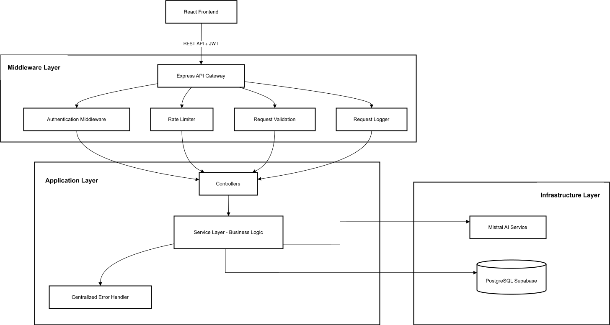

# AI Appointment Platform - Senior Full Stack Implementation

This project is a solid, end-to-end system for booking appointments using AI. Instead of a simple CRUD app, I’ve built it with a **SaaS-first mindset**, focusing on data integrity, security, and a smooth user experience.

---

## 🏗️ The Big Picture (Architecture)

I used a **Layered Architecture** to keep the code clean and easy to test. Every part of the app has a specific job:



### Layered Structure
- **Middleware Layer**: Enforces security (JWT), rate limiting, and input validation before requests reach logic.
- **Application Layer**: Contains **Controllers** for request handling and **Services** for core business rules and AI orchestration.
- **Centralized Error Handling**: A unified system to catch and format all errors consistently across the API.
- **Infrastructure Layer**: Handles data persistence with **PostgreSQL (Supabase)** and AI capabilities with **Mistral AI**.

---

## 🚀 Getting Started

### Prerequisites
- **Node.js** (v18 or higher)
- **Postgres** (Running locally or on the cloud)
- **Mistral API Key** (You can get a free one at [console.mistral.ai](https://console.mistral.ai))

### 1. Database Setup
```bash
# Create the database
psql -U postgres -c "CREATE DATABASE appointment_platform;"

# Run the schema (tables) and sample data
psql -U postgres -d appointment_platform -f database/schema.sql
psql -U postgres -d appointment_platform -f database/seed.sql
```

### 2. Environment Setup
Create a `.env` file in the `backend` folder:

```env
PORT=3000
DB_HOST=localhost
DB_NAME=appointment_platform
DB_USER=postgres
DB_PASSWORD=your_password
JWT_SECRET=pick_a_random_string
MISTRAL_API_KEY=your_key_here
```

### 3. Run the App
```bash
npm install
npm run dev
```
The API will be live at `http://localhost:3000`.

---

## 💎 Key Features & Senior-Level Decisions

### 1. Multi-Tenancy (Built for Scale)
I didn't just add a `business_id` column. I created a proper `businesses` table. This means the app can support multiple companies (SaaS style) while keeping their data completely separate and safe.

### 2. No More Double-Bookings
Race conditions are a common problem in booking apps. I solved this at the database level using a **Unique Partial Index**. Even if two people click "Book" at the exact same millisecond, the database will only allow one, preventing any messy overlaps.

### 3. Soft Deletes (Safety First)
In a real-world app, deleting data permanently is risky. I used a `deleted_at` strategy. This keeps an audit trail for the business and allows us to recover data if a user deletes something by mistake.

### 4. Smart AI Integration
Instead of just "chatting," I trained the AI (via prompts) to behave like a data extractor. It identifies dates, times, and services from messy user messages and turns them into clean data our system can use.

---

## ⚖️ Tradeoffs (Real-world Thinking)

- **Date/Time Handling**: I used separate columns for Date and Time to make it easier for business owners to run daily reports. While Timestamps are powerful, this split is much more human-readable for an MVP.
- **AI Latency**: AI takes a second to think. To keep the UX good, I implemented "Loading" states on the frontend so the user never feels like the app is stuck.

---

## 📝 Known Limitations

- **WebSockets**: Currently uses standard REST. For a high-traffic chat, I'd upgrade this to WebSockets for real-time speed.
- **Fixed Durations**: Right now, all appointments are 60 minutes. Adding variable durations would be my next step.

---

## 📝 API Reference

For a detailed API reference, see the [API Reference](API_REFERENCE.md) document.


---

**Built for the Spark AI Technical Assessment.**
